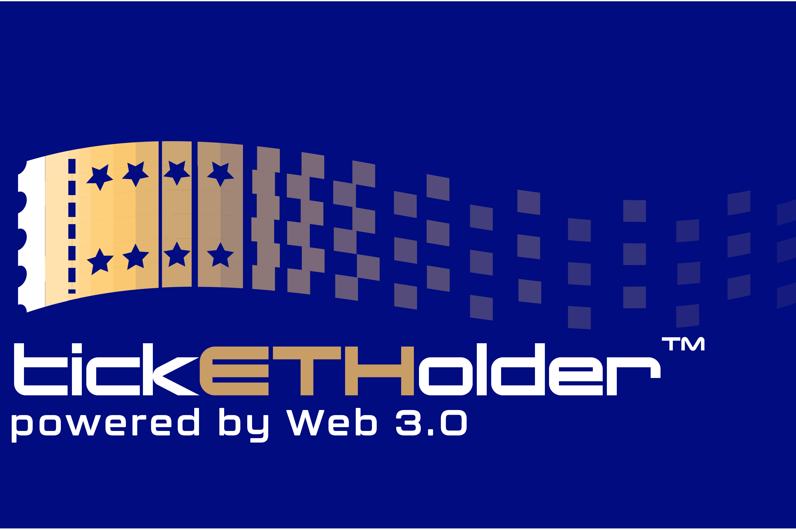

# Project-3-Solidity-Ticketing-dApp
# Python & Solidity Smart Contract Project
# tickETHolder inc. ®™

---

## <i>Overview of the Analysis</i>

---

## <b>Purpose:</b>

The purpose of this program is to develop a decentralized blockchain ticket sales dApp for events & concerts sales. It incorporates a web-based smart contract solution for small to medium scale venue ticket sales, management, & distribution.  The front-end utilizes a Streamlit GUI interface running with Python (developed with the VS Code IDE ). Interacting between the user interface in order to preserve seats chosen & keep track of seats sold, reserved & sold seating information is tracked with Streamlit's Session State functions. Sold seat tracking & marking, on the other hand, are handled with JSONbin's central server solutions. The back-end of the dApp is designed and coded with Solidity using the Remix IDE. Solidity runs an Ethereum contract that leverages the ERC721 NFT based smart contract framework. The NFTs developed into tickets with this application are ultimately filed & stored using IPFS hashing (with the Pinata handling the IPFS gateway for the administration side). The web-interface allows a user to interface with an interactive GUI that includes sectional layouts of each venue's seating plan to find seats available for sale, select seats (up to four seats per session) & purchase them utilizing a linked ETH wallet (via Metamask connectivity through a select/dropdown box for wallet selection). The front-end then displays the blockchain transaction receipts via the sidebar panel in chronological order. Finally, at the end of a ticket purchasing session, the user is presented with the URL of the NFT ticket to use as proof of admission complete with critical barcoded information for entrance/security purposes.

---

## <b>Process & Variables:</b>

The sequence of steps that were involved in developing this application were as follows:
<ol> 
Step 1: Develop front end GUI Streamlit user interface; included designing algorithms capable of 'drawing' the concert venue layouts as accurate seating representations. Design of the front end user interface included basic form submission fields for first name, last name, and wallet address to enable transactions to occur over the blockchain. 
 
Step 2: Create JSONbin json update capabilities to handle long term variable storage for ticket/seat sales management while minimizing security breaches of customer data.
 
Step 3: Engineer backend blockchain smart contract interaction utilizing Solidity and Ethereum's ERC721 NFT framework & constructor/method libraries. 
 
Step 4: Build administration side GUI Streamlit interface that incorporates fully customizable contract ABI selectivity, easier ticket minting customization & event/venue management that is provided in the standard Remix IDE. Additionally, the admin dashboard has a section dedicated for full NFT customization & generation.
 
Step 5: Setup and code IPFS generator software and interactivity between Pinata gateway to facilitate design of IPFS hashes & URLs for customer NFT access & use. 
</ol>

### <b><u>Step 1: Development of Front End Gui Streamlit User Interface</b></u>
 
Using an amalgamation of Python & Streamlit coding solutions, the philosophy behind the front end was to simplify user interaction but retain maximum capabilities in terms of intent of serviceability. In terms of form submission, the user is simply required to enter a first name, last name and connect their ETH wallet in order to make seat/ticket purchases. The body of the Streamlit dApp offers a comprehensive & accurate representation of the venue's seating options with sectional filtering optionality. A Streamlit selectbox dropdown menu enables users to select & confirm up to four seats per session for purchase. Selected seating is presented to the user via a change of color from 'light blue' to 'green', while sold seating is cached via JSONbin and appears greyed out to the user (as unavailable for purchase). On the right hand side bar, other optional drop down boxes will offer venue selection & event filtering as well as button interactivity to switch sectional views within a particular venue. In forthcoming versions of tickETHolder™, it is the intention to integrate an automated chatbot to facilitate any support & help inquiries the customer may have while interacting with the site.
 

 

### <u><b>Step 2: Creation of JSONbin Integration</b></u>
 
The front end is again supported by a variety of back-end features, which include data storage of data that is deemed functional to the user interface, but not critical or confidential in the sense it does not threaten the security of user's private information. Note: Any 'personal' information displayed in current JSONbin bin versions are for troubleshooting purposes only. In future versions, the only data to be retained in JSON will be logging seat numbers in order to determine binary states; i.e. that is which seats are sold or still available for purchase. 

 

### <u><b>Step 3: Engineering Solidity Blockchain Back-End</b></u>
 
i.) Front End User Integration - The back-end was engineered by leveraging blockchain smart contract interaction utilizing Solidity and Ethereum's ERC721 NFT framework & constructor/method libraries, as previously mentioned. The justification for developing the system with this approach was to take advantage of the ERC721's tokenization & attribute storage capabilities into object like form. ERC721 tokens enable tickETHolder™ to retain the necessary secure information related to each unique ticketing including ticket owner, first name, last name, event/concert name/title, the concert date (note: currently being stored in uint UNIX format), ticket price, venue name, seat number, seat color (for testing purposes; later to be dropped to reduce gas fees as its deemed during beta to not necessarily be required at this point), and ipfsHash. The ipfsHash being stored, currently, in the beta testing version of this app is actually the full URL (that has been concatenated with the Pinata gateway & unique hash identifier of each individual ticket). This enables the user to have quick hyperlink access if needed to access the ticket in multiple fashions & present the integrated QR code if/when required. 

ii.) Front End Admin Integration - Additionally, the back-end provides the necessary code for running the ticket data customization, minting/distribution, and data call access and analysis from the admin side. (See below for further information). 
 

### <u><b>Step 4: Development of Front End Gui Streamlit Admin Interface </b></u>

On the admin side, the specialized dashboard allows for the initial contract owner deployer (venue owner, management company, etc.) to connect directly with their contract via ABI text-input connectivity support. The admin sidebar dashboard displays Web3 & contract connectivity display & confirmation to ensure the admin is connected to their contract properly. From there, the 'Minter Admin Console' provides a customizable form that enables complete ticket concert/event customization including enabling the admin to set maximum number of tickets available for minting/purchase (i.e. depending on the constraints of the particular venue size), _ownerFirstName, _ownerLastName, _eventName, _concertDate, _price (Gwei), _venueName, and batchSize. 

For instance, when minting tickets for an event, the admin can leave the generic placeholder string variables i.e. 'First Name', 'Last Name', etc. while setting the basic ticket information such as '_eventName', '_venueName', '_concertDate', etc. 

Furthermore, the '_batchSize' feature enables automatic minting of tickets in set batch sizes. Note: It is advisable during beta testing to limit batch size minting to 50-tickets at a time due to Solidity blockchain system constraints. In the future, code will be modified to handle higher batch requests through either code revision, or migrating to a faster blockchain token (i.e. Polygon (MATIC) testnet (Mumbai)). 

### <u><b>Step 5: IPFS Generator Software & Pinata Gateway Access </b></u>

On the admin side, the specialized dashboard allows for the initial contract owner deployer (venue owner, management company, etc.) to connect directly with their contract via ABI text-input connectivity support. The admin sidebar dashboard displays Web3 & contract connectivity display & confirmation to ensure the admin is connected to their contract properly. From there, the 'Minter Admin Console' provides a customizable form that enables complete ticket concert/event customization including enabling the admin to set maximum number of tickets available for minting/purchase (i.e. depending on the constraints of the particular venue size), _ownerFirstName, _ownerLastName, _eventName, _concertDate, _price (Gwei), _venueName, and batchSize. 

For instance, when minting tickets for an event, the admin can leave the generic placeholder string variables i.e. 'First Name', 'Last Name', etc. while setting the basic ticket information such as '_eventName', '_venueName', '_concertDate', etc. 

Furthermore, the '_batchSize' feature enables automatic minting of tickets in set batch sizes. Note: It is advisable during beta testing to limit batch size minting to 50-tickets at a time due to Solidity blockchain system constraints. In the future, code will be modified to handle higher batch requests through either code revision, or migrating to a faster blockchain token (i.e. Polygon (MATIC) testnet (Mumbai)). 

 

 

---

## <b>Results:</b>

<u> 1.) tickETHolder™ Front End GUI Interface: </u>

  

  
  

  <i>The figure above illustrates a user interaction with a test version of tickETHolder™ interface.</i>
   
   

<u> 2.) tickETHolder™ Admin End GUI Interface: </u>

  

  
  

  <i>The admin front end dashboard enables custom ABI contract connectivity, flexible event/concert minting options & variable 'batch' minting that enables unique service features such as advanced ticket sales and sectional price configuration. In future versions, the 'NFT Image Constructor' panel will enable admin full control over NFT image design & deployment to make each event unique & memorable.</i>
   
   

<u> 3.) tickETHolder™ Ticket Purchase Complete with Blockchain Confirmation Receipts & Pinata Gateway IPFS Image Links for NFT Ticket Access:</u>

  

  
  

  <i>The above completed test transaction displays to the user the blockchain confirmation receipts for each ticket purchase completed during a particular session, complete with its associated IPFS image associated links for access to each ticket.</i>
   
   

  <u> 4.) tickETHolder™ Pinata IPFS Gateway Hyperlink to NFT Ticket Image</u>

  

  
  

  <i> Illustrated above, is what the user will see if they open their ticket via the provided Image URL which has its unique IPFS hash code incorporated into the ubiquitous Pinata gateway URL. </i>
   
   

<u> 5.) tickETHolder™ Fully Customizable NFT Ticket Design With QR Code for Venue Access:</u>

  

  
  

  <i>Example of ticket for theoretical 'Gorillaz' event to take place at Toronto's infamous 'Massey Hall' on 08/08/2022. Note: Gorillaz image useage is only for demonstration/example purposes and this NFT has no commercial value. The art & usage is borrowed and all IP is that of musician Damon Albarn and artist Jamie Hewlett, Parlophone, Virgin Music & © 2023 Warner Music UK Limited. All rights reserved.</i>
   
   

## <b>Summary:</b>

In summary, functionality of the dApp was a success, but there are further improvements, developments & add-ons to be implemented in the future. 
In the future modular add-ons will include functions/library imports to include plug & play unique venue and sectional space options. Furthermore, the NFT Generator Lab will be completed in order to customize NFT tickets depending upon their current venue requirements. Additionally, this progam is expected to be tested on the ETH Goerli test-net & eventually migrated to the Polygon (MATIC) Mumbai test-net. 
